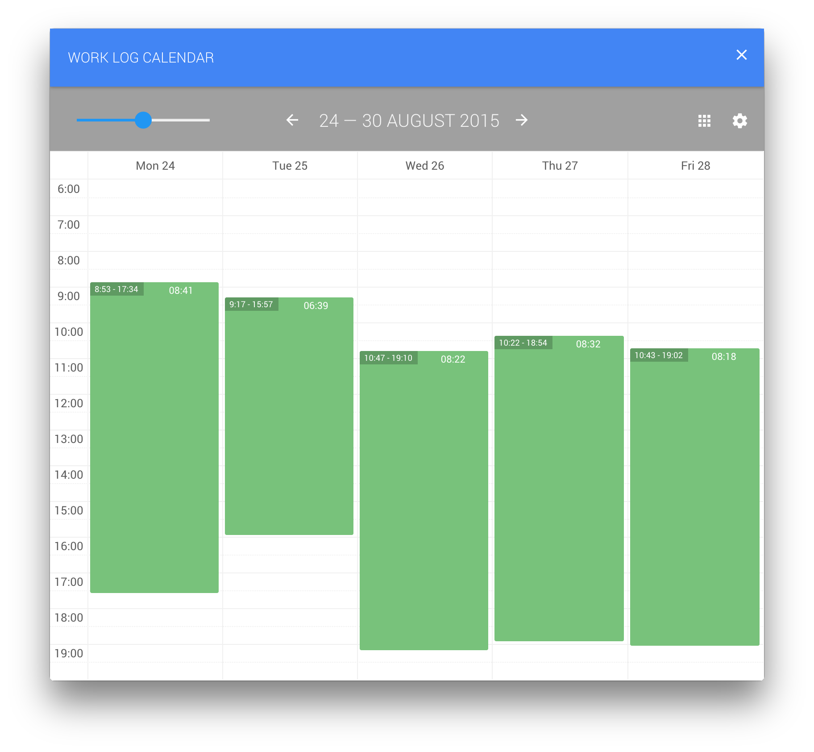
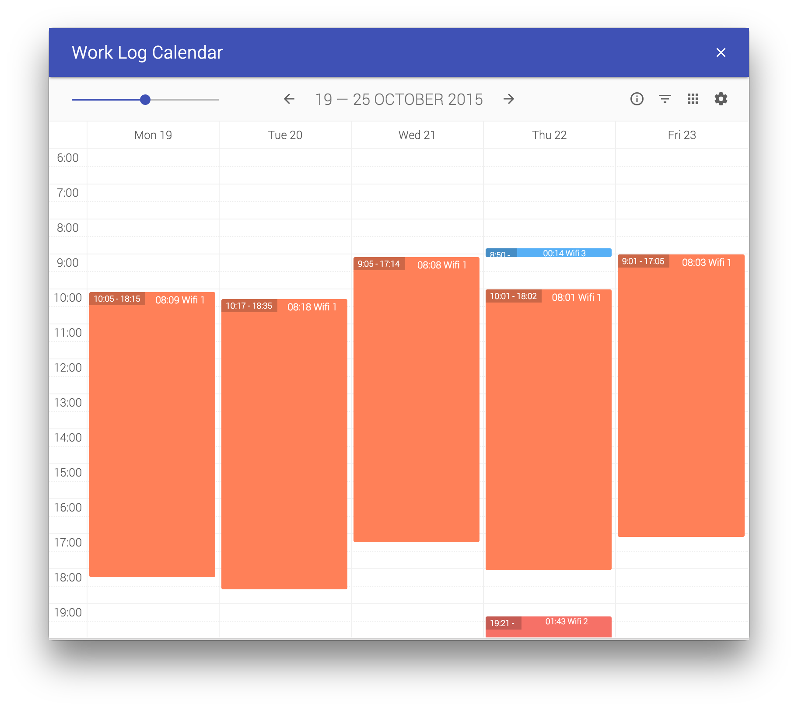
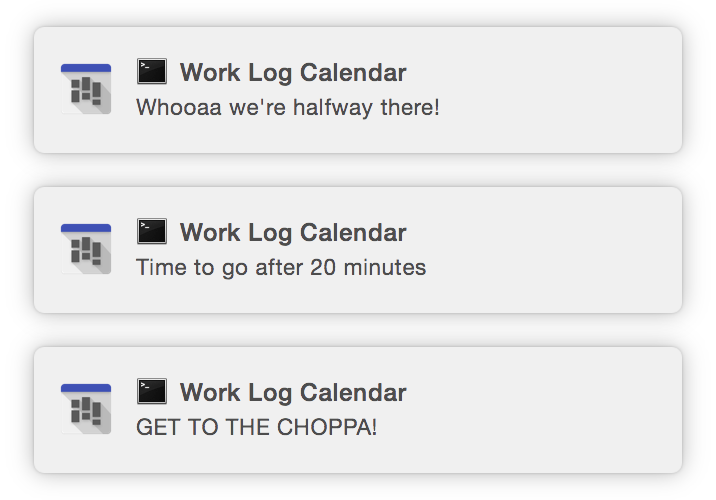
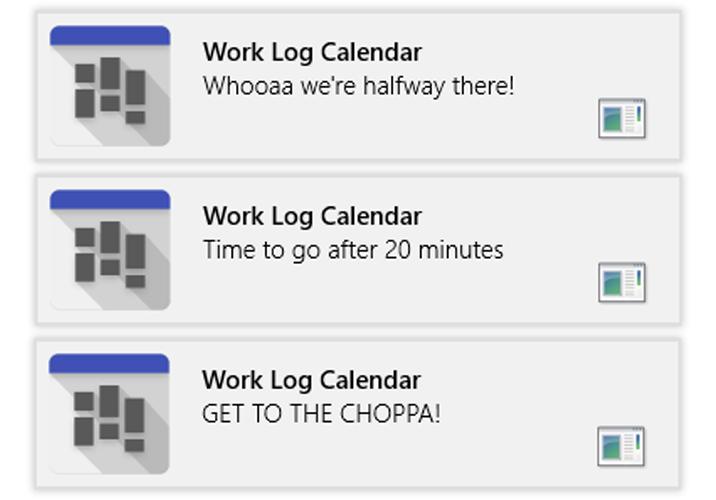
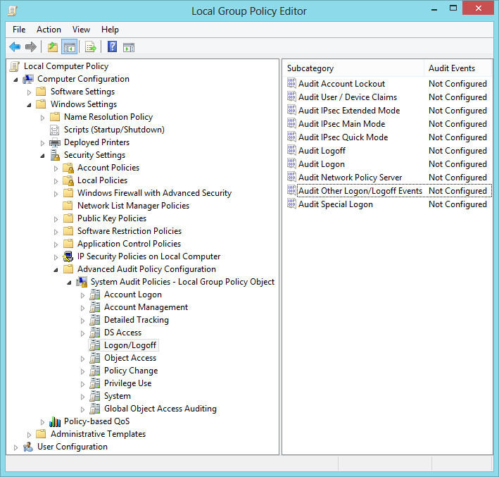

# work-log-calendar

> A visual representation of the system logs from your computer.

**[Download the latest version](https://github.com/dirkstals/work-log-calendar/releases/latest)**

See the time you actually spend on your computer. It creates time slots based on the activities of your computer.
On Mac it is a combination of shutdown events and the moment at which the display is switched on and off.
Windows has a different logging system and therefore it combines a bunch of events. You might get a more detailed view when you have administrator rights.

## Usage

**Download** the zip file on [this page](https://github.com/dirkstals/work-log-calendar/releases/latest), for your OS. *win* stands for Windows and *osx* for Mac. 
Unzip the file and doubleclick on the app (WorkLogCalendar.app or WorkLogCalendar.exe).

## Developers only

You will need nodeJS for this to run.
Clone the git repository. In terminal or command line, go to the project folder.
Type in 

	npm install
	
to download all required node modules. 
If it's finished, type in 
	
	npm start
	
Or in one line
    
    npm install && npm start

## WiFi Filter

You can switch on the wifi filter, so you can see a difference between timeslots in a different location.

## Notifications

On the last hour of your work day, you will be notified with the minutes left to work.

## Windows event logging

The screen saver and workstation locking event is not logged by default. 
To enable logging you need to run gpedit.msc (Local Group Policy Editor). Navigate to **Computer configuration > Windows Settings > Security Settings > Advanced Audit Policy Configuration > System Audit Policies > Logon/Logoff**. Then in "**Audit Other Logon/Logoff Event**" check the box for Success. It will enable event logging for :

* Locking and unlocking a workstation.
* Invoking a screen saver.
* Dismissal of a screen saver.

