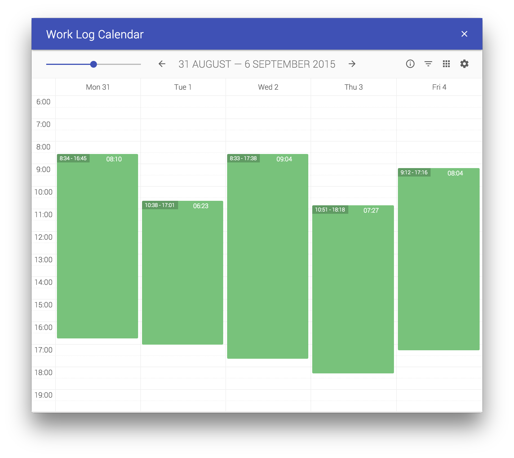

# work-log-calendar

> A visual representation of the system logs of your computer.

See the time you actually spend on your computer. It creates time slots based on activities of your computer.
On Mac it is a combination of shutdown events and the moment when the display turns off and on.
Windows has a different logging system and therefore it combines a bunch of events, listed in the app.

## Usage

Download the [latest release](https://github.com/dirkstals/work-log-calendar/releases/latest) for your OS and run the app.

Note: Run as Administrator on Windows
